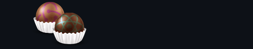

# Dapp Examples using truffle box : unbox SandyLudosky/react-redux-box



1. TodoList
2. Multiple contracts

## To install the box

1. Create a new directory.

2. In the new directory, run `truffle unbox SandyLudosky/react-redux-box`. This should pull the box contents to the new local directory.

## After unboxing

run :

```
npm run install-pkg
```

In the main project directory:

```
truffle develop
```

Then, in the Truffle developer console:

```
compile
```

and then:

```
migrate
```

To test your smart contract(s), in truffle's developer console:

```
test
```

Now that you have successfully launched your Solidity contract onto your local blockchain, go into the client directory:

Run the project by entering the following:

```
npm start
```

To see your project in the browser, go to http://localhost:3000/

You can test your DApp by entering the following:

```
npm test
```
